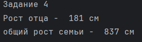

# Теория алгоритмов. lab1
# Задание 0:
## Условие: Есть словарь координат городов. Нужно составить словарь словарей расстояний между ними, используя формулу
((x1 - x2) ** 2 + (y1 - y2) ** 2) ** 0.5
## Решение:
с помощбю цикла for проходимся по словарю и для каждого города создаем вложенный список. далее 
с помощью второго цикла for для каждого sity1 и sity находим расстояние по формуле
for city1 in sites:
    distances[city1] = {}
    for city2 in sites:
        if (city1 != city2):
            distance = calculateDistance(city1, city2)
            distances[city1][city2] = distance
## Результат:
{'Moscow': {'London': 145.60219778561037, 'Paris': 130.38404810405297}, 'London': {'Moscow': 145.60219778561037, 'Paris': 42.42640687119285}, 'Paris': {'Moscow': 130.38404810405297, 'London': 42.42640687119285}}
# Задание 1:
## Условие: 1) Есть значение радиуса круга. Выведите на консоль значение площади этого круга с точностью до 4-х знаков после запятой
2) Пусть есть координаты точки. Если точка _point1 (23, 34)_ лежит внутри того самого круга, то выведите на консоль True, или False, если точка лежит вовне круга.
3) Аналогично пункту 2 для точки _point2(30, 30)_

## Решение:
для нахождения площади круга используем формулу 
area = PI * radius**2, где PI - число пи, равное 3.1415926
def calculateArea(radius):
    return round(PI * radius ** 2, 4)
для того, чтобы определить находится ли точка внутри круга, используется следующая формула
distanse = ((x - x0)**2 + (y - y0)**2)**0.5
если distanse <= radius, тогда точка находится внутри/на границе окружности. иначе - вне
def poinInCiecle(point, radius, center):
    x = point[0]
    y = point[1]
    x0 = center[0]
    y0 = center[1]
    distanse = ((x - x0)**2 + (y - y0)**2)**0.5
    return distanse <= radius**2
## Результат:

# Задание 2:
## Условие: Расставьте знаки операций "плюс", "минус", "умножение" и скобки между числами "1 2 3 4 5" так, что бы получилось число "25".
## Решение:
Для решения используется метод подбора
result = (1 + 2) * 3
итоговая функция:
def res():
    str = "1 * (2+3) * 4 + 5 = "
    res = 1 * (2+3) * 4 + 5
    print(str, res)
    return ""
## Результат: 1 * (2+3) * 4 + 5 =  25
# Задание 3:
## Условие: Есть строка с перечислением фильмов: `'Терминатор, Пятый элемент, Аватар, Чужие, Назад в будущее'`
Выведите на консоль с помощью индексации строки, последовательно:
1) первый фильм 
2) последний 
3) второй 
4) второй с конца
## Решение:
для облегчения выполнения задания определим индексы запятых
comma1 = my_favorite_movies.index(',')
comma2 = my_favorite_movies.index(',', comma1 + 1)
comma3 = my_favorite_movies.index(',', comma2 + 1)
comma4 = my_favorite_movies.index(',', comma3 + 1)
далее с помощью срезов найдем нужные нам фильмы
def movies():
    firstMovie = my_favorite_movies[:comma1]
    lastMovie = my_favorite_movies[comma4+2:]
    secondMovie = my_favorite_movies[comma1+2:comma2]
    secondLastMovie = my_favorite_movies[comma3+2:comma4]
    print("Первый фильм - ", firstMovie)
    print("Последний фильм - ", lastMovie)
    print("Второй фильм - ", secondMovie)
    print("Второй с конца фильм -" , secondLastMovie)
    return ""
прибавление 2 к некоторым запятым обусловлено пропуском той самой запятой и пробелом после нее

## Результат:

# Задание 4:
## Условие: Нужно создать список семьи в формате `ИМЯ, РОСТ`, после чего
1) Вывести на консоль рост отца в формате `Рост отца - ХХ см `
2) Вывести на консоль общий рост семьи как сумму ростов всех членов

## Решение:
Создадим список списков:
my_family_height = [
    # ['имя', рост],
    ['Брат', 160],
    ['Мать', 165],
    ['Отец', 181],
    ['Бабушка', 161],
    ['Дедушка', 170],
]
для вывода роста отца из списка используем индекс отца в списке
def getHightFather():
    return my_family_height[2][1]
Чтобы вывести общий рост семьи, пройдемся по списку с помощью цикла for 
и суммируется рост каждого члена семьи
def totalHight():
    hight = 0
    for person in my_family_height:
        hight += person[1]
    return hight
## Результат:

# Задание 5:
## Условие: Есть список животных в зоопарке: `['lion', 'kangaroo', 'elephant', 'monkey', ]`
1) Посадите медведя (bear) между львом и кенгуру
2) Добавьте птиц из списка birds в последние клетки зоопарка
3) Уберите слона
4) Выведите на консоль в какой клетке сидит лев (lion) и жаворонок (lark)

## Решение:
для добавление нового элемента в список, используем insert(index, 'object')
zoo.insert(1, "bear")
для добавления элемента в конец списка можно использовать extend('object')
zoo.extend(birds)
для удаления элемента из списка испльзуется remove
zoo.remove('elephant')
чтобы вывести новера клеток - index(object)
zoo.index('lion') + 1, zoo.index('lark') + 1
прибавление 1 служит для того, чтобы номер клетки был понятен простому человеку
## Результат:

# Задание 6:
## Условие:
1) Есть список песен группы Depeche Mode со временем звучания с точностью до долей минут. Распечатайте общее время звучания трех песен: 'Halo', 'Enjoy the Silence' и 'Clean' в формате `Три песни звучат ХХХ.XX минут`
2) Есть словарь песен группы Depeche Mode со временем звучания с точностью до долей минут. Распечатайте общее время звучания трех песен: 'Sweetest Perfection', 'Policy of Truth' и 'Blue Dress' в формате `А другие три песни звучат ХХХ минут`

## Решение:
проходимся по списку с помощью цикла for, если i есть среди нужных песен(in [список песен]), то
длительносость песен суммируется. Результат округляется до сотых с помощью round
def totalTimeList():
     totalTime = 0
     for i in violator_songs_list:
        if (i[0] in ['Halo', 'Enjoy the Silence' ,'Clean']):
           totalTime += i[1]
     totalTime = round(totalTime, 2)
     return totalTime
для подсчета времени других песен по ключу (название песни) словаря находим длительность
и также считаем и окгругляем
def totalTimeDict():
     totalTime = (
        violator_songs_dict['Sweetest Perfection']+
        violator_songs_dict['Policy of Truth']+
        violator_songs_dict['Blue Dress']
     )
     totalTime = round(totalTime, 2)
     return totalTime
## Результат:

# Задание 7:
## Условие:Есть зашифрованное сообщение:
`secret_message = [
    'квевтфпп6щ3стмзалтнмаршгб5длгуча',
    'дьсеы6лц2бане4т64ь4б3ущея6втщл6б',
    'т3пплвце1н3и2кд4лы12чф1ап3бкычаь',
    'ьд5фму3ежородт9г686буиимыкучшсал',
    'бсц59мегщ2лятьаьгенедыв9фк9ехб1а',
]`
Нужно его расшифровать и вывести на консоль в удобочитаемом виде. Должна получиться фраза на русском языке, например: как два байта переслать.
_Ключ к расшифровке:_
1. первое слово - 4-я буква 
2. второе слово - буквы с 10 по 13, включительно 
3. третье слово - буквы с 6 по 15, включительно, через одну 
4. четвертое слово - буквы с 8 по 13, включительно, в обратном порядке 
5. пятое слово - буквы с 17 по 21, включительно, в обратном порядке

## Решение:
следуя инструкции расшифроввываем сообщение, используя срезы
def secretMessage():
    word1 = secret_message[0][3]
    word2 = secret_message[1][9:13]
    word3 = secret_message[2][5:15:2]
    word4 = secret_message[3][12:6:-1]
    word5 = secret_message[4][20:15:-1]
    str = word1 + " "+ word2 + " "+ word3 + " "+ word4 + " "+ word5
    return str
## Результат:
в бане веник дороже денег
# Задание 8:
## Условие: Есть два списка цветов, произрастающих на лугу и в саду:

garden = ('ромашка', 'роза', 'одуванчик', 'ромашка', 'гладиолус', 'подсолнух', 'роза', )
meadow = ('клевер', 'одуванчик', 'ромашка', 'клевер', 'мак', 'одуванчик', 'ромашка', )

Нужно выполнить задачи на работу со множествами.
## Решение:
Для создания множества уникальных элементов (без повторений) используется set
garden_set = set(garden)
meadow_set = set(meadow)
для того, чтобы из двух списков создать множество элементов, которые есть в двух списках
используется &
garden_set & meadow_set
Для того, чтобы создать множество элементов, которое есть в одном списке, но нет другого
используется -
garden_set - meadow_set
meadow_set - garden_set
## Результат:

# Задание 9:
Условие: Есть словарь магазинов с распродажами. Создайте словарь цен на продукты (писать прямо в коде), указать 2 магазина с минимальными ценами.
## Решение:
в ручную создадим словарь с минимальными ценами
sweets = {
    'Печенье': [
        #{'shop': 'название магазина', 'price': 99.99},
        # TODO тут с клавиатуры введите магазины и цены (можно копипастить ;)
        {'shop': 'пятерочка', 'price': 9.99},
        {'shop': 'ашан', 'price': 10.99}
    ],
    # TODO тут с клавиатуры введите другую сладость и далее словарь магазинов
    'Конфеты': [
        {'shop': 'магнит', 'price': 30.99},
        {'shop': 'пятерочка', 'price': 32.99}
    ],
    'Карамель':[
        {'shop': 'магнит', 'price': 41.99},
        {'shop': 'ашан', 'price': 45.99}
    ],

    'Пирожное': [
        {'shop': 'пятерочка', 'price': 59.99},
        {'shop': 'магнит', 'price': 62.99}
    ]

}
## Результат:

#Задание 10:
## Условие:
Есть словарь кодов товаров:

goods = {
    'Лампа': '12345',
    'Стол': '23456',
    'Диван': '34567',
    'Стул': '45678',
}

Есть словарь списков количества товаров на складе:
store = {
    '12345': [
        {'quantity': 27, 'price': 42},
    ],
    '23456': [
        {'quantity': 22, 'price': 510},
        {'quantity': 32, 'price': 520},

Рассчитать на какую сумму лежит каждого товара на складе.
## Решение:
для расчета стоимости товара используется формула:
СТОИМОСТЬ = КОЛИЧЕСТВО * ЦЕНА
на примере ламп
КОЛИЧЕСТВО = store[goods['Лампа]][0]['quality']]
ЦЕНА = store[goods['Лампа']][0]['price']
ИТОГ: lamps_cost = store[goods['Лампа']][0]['quantity'] * store[goods['Лампа']][0]['price']
или
def lampCost():
    lamp_code = goods['Лампа']
    lamps_item = store[lamp_code][0]
    lamps_quantity = lamps_item['quantity']
    lamps_price = lamps_item['price']
    lamps_cost = lamps_quantity * lamps_price
аналогично для каждого товара
## Результат:

